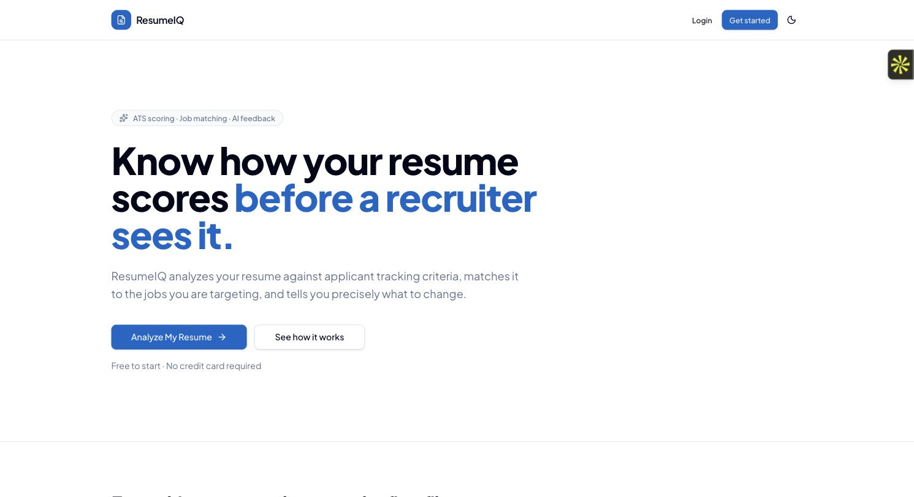
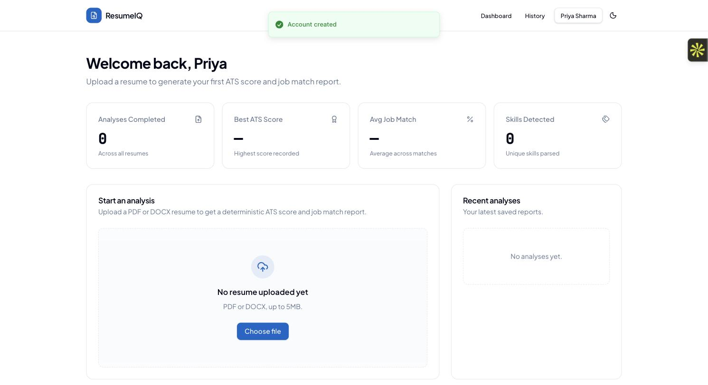
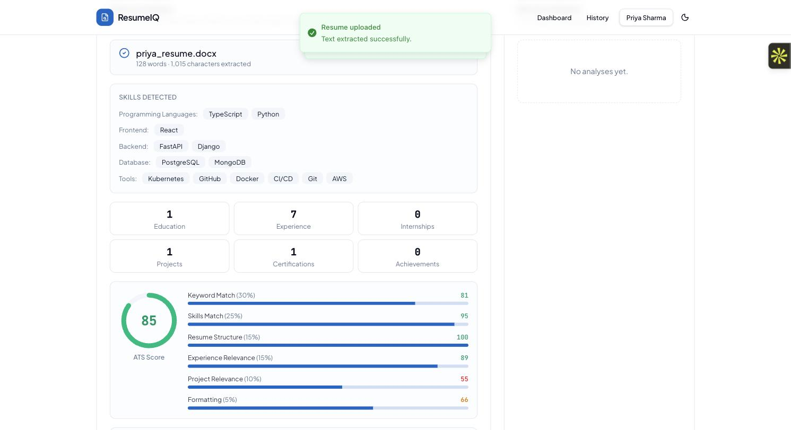
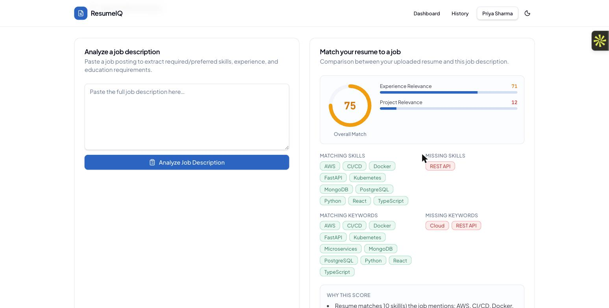
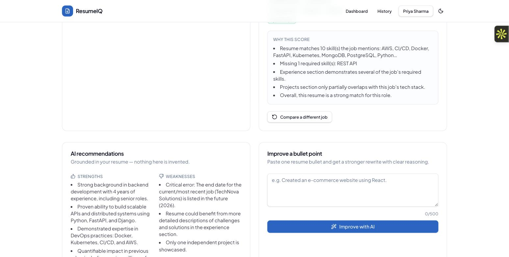

# AI Resume Analyzer & Job Match Platform

A full-stack platform that parses resumes, scores them against ATS-style criteria
**deterministically** (regex/keyword-based — never AI-guessed), matches them against job
descriptions, and generates grounded AI recommendations for improvement. Built with
React (TanStack Start) + FastAPI + MongoDB.

**Live:**
- App: https://resume-analyzer-frontend-five-eta.vercel.app
- API: https://resume-analyzer-backend-production-0251.up.railway.app/api
- API health: [`/api/health`](https://resume-analyzer-backend-production-0251.up.railway.app/api/health) · [`/api/health/db`](https://resume-analyzer-backend-production-0251.up.railway.app/api/health/db)

## Screenshots

| | |
|---|---|
|  Landing page |  Dashboard |
|  Deterministic ATS score breakdown |  Resume ↔ job match with skill/keyword gaps |
|  Grounded AI recommendations | |

## What it does

1. **Upload** a resume (PDF or DOCX) — text is extracted and structured into contact info,
   skills, experience, education, projects, and certifications.
2. **ATS score** — a deterministic 0–100 score (keyword match, skills coverage, structure,
   experience depth, project relevance, formatting) computed from the parsed resume alone.
   No AI involved in scoring, on purpose: scores need to be reproducible and explainable.
3. **Job match** — paste a job description; it's parsed for required skills/keywords and
   compared against the resume for a match percentage and gap analysis.
4. **AI recommendations** — an LLM (Gemini or OpenAI, configurable) suggests concrete
   improvements and rewrites weak bullet points, constrained to never invent experience that
   isn't in the original resume.
5. **History & comparison** — every analysis is saved per-user; past analyses can be browsed,
   compared side by side, or deleted.
6. **PDF report export** — download a generated report of any saved analysis.

## Tech Stack

**Frontend:** React 19, TanStack Start (file-based routing + SSR), TypeScript, Tailwind CSS v4,
shadcn/ui, TanStack Query, Recharts. Scaffolded with [Lovable](https://lovable.dev), wired to
this repo's own FastAPI backend (plain `fetch`, JWT in localStorage — no Supabase/Lovable Cloud).

**Backend:** Python 3.12, FastAPI, Pydantic v2, Motor (async MongoDB driver), JWT auth
(python-jose + passlib/bcrypt), slowapi (rate limiting).

**Database:** MongoDB, run as a Railway service on the app's own private network (see
[Deployment](#deployment) for why).

**AI:** Configurable provider (Gemini or OpenAI) via environment variables — used only for
recommendations and bullet rewrites, never for scoring or matching.

**Resume/JD parsing:** PyMuPDF (PDF), python-docx (DOCX), regex/keyword-based structuring —
deterministic, not AI.

## Project Structure

```
Resume_Analyzer_Prakash/
├── backend/
│   ├── main.py                 # FastAPI entrypoint, middleware, routers
│   ├── app/
│   │   ├── config.py           # env-driven settings
│   │   ├── database.py         # MongoDB connection (Motor)
│   │   ├── routes/             # auth, resume, job, match, ai, analysis, dashboard
│   │   ├── services/           # parsing, ATS scoring, JD matching, AI, PDF reports
│   │   ├── models/             # MongoDB document models (Pydantic)
│   │   ├── schemas/            # request/response schemas
│   │   └── utils/              # security, rate limiting, validators
│   ├── tests/                  # pytest — 141+ tests against a real MongoDB
│   ├── requirements.txt
│   ├── railway.json            # Railway/Nixpacks build config
│   └── .env.example
├── frontend/
│   ├── src/
│   │   ├── routes/             # file-based routes: /, /login, /register,
│   │   │                         /dashboard, /history, /profile
│   │   ├── components/         # upload card, ATS score ring, JD/match cards,
│   │   │                         AI recommendation cards, navbar, theme toggle
│   │   ├── context/             # ThemeContext (dark/light)
│   │   ├── lib/                 # api.ts, auth.ts, utils
│   │   └── hooks/
│   ├── vite.config.ts           # Nitro preset: vercel
│   └── .env.example
└── README.md
```

## Running Locally

### Backend

```bash
cd backend
python3.12 -m venv venv
source venv/bin/activate
pip install -r requirements.txt
cp .env.example .env   # fill in MongoDB URI, JWT secret, AI API key
uvicorn main:app --reload --port 8000
```

**Local MongoDB** (no Atlas/cloud account needed for development):

```bash
docker run -d --name resume-analyzer-mongo -p 27017:27017 mongo:7
# backend/.env: MONGODB_URI=mongodb://localhost:27017
```

`FRONTEND_URL` in `backend/.env` is a **comma-separated list** of allowed CORS origins.

### Frontend

```bash
cd frontend
npm install
cp .env.example .env   # VITE_API_URL=http://localhost:8000/api
npm run dev
```

Runs on the first free port starting at `8080` (printed on startup).

## API Reference

All routes are prefixed `/api`. Authenticated routes require `Authorization: Bearer <token>`.

| Method | Path | Auth | Description |
|---|---|---|---|
| POST | `/auth/register` | No | Create an account, returns a JWT |
| POST | `/auth/login` | No | Exchange email/password for a JWT |
| GET | `/auth/me` | Yes | Current user's profile |
| POST | `/auth/logout` | Yes | Client-side token discard (JWT is stateless) |
| POST | `/resume/upload` | Yes | Upload a PDF/DOCX, get extracted text + structured parse |
| POST | `/resume/analyze` | Yes | Deterministic ATS score from extracted resume text |
| POST | `/job/analyze` | Yes | Parse a job description into required skills/keywords |
| POST | `/match/analyze` | Yes | Resume ↔ job description match score + gap analysis |
| POST | `/ai/recommendations` | Yes | Grounded AI improvement suggestions |
| POST | `/ai/improve-bullet` | Yes | AI rewrite of a single resume bullet |
| POST | `/analysis/save` | Yes | Persist a full analysis (resume + ATS + match) |
| GET | `/analysis/history` | Yes | List saved analyses for the current user |
| GET | `/analysis/{id}` | Yes | Full detail of one saved analysis |
| DELETE | `/analysis/{id}` | Yes | Delete a saved analysis |
| POST | `/analysis/compare` | Yes | Side-by-side comparison of two saved analyses |
| GET | `/analysis/{id}/report` | Yes | Download a generated PDF report |
| GET | `/dashboard/stats` | Yes | Aggregate stats (best score, avg match, skill count) |
| GET | `/health` | No | Liveness check |
| GET | `/health/db` | No | MongoDB connectivity check |

## Backend Tests

```bash
cd backend
source venv/bin/activate
pytest -v
```

Needs a reachable MongoDB (see "Local MongoDB" above) — tests run against a separate
`resume_analyzer_test` database, never dev data. Covers auth edge cases (expired/tampered/
`alg:none`-forged JWTs), rate limiting, the full upload→score→match→save→history flow, and the
`PyObjectId` serialization boundary between BSON and JSON.

## Deployment

**Frontend** — Vercel, Nitro's `vercel` preset (`frontend/vite.config.ts`).

**Backend + database** — Railway, not Vercel. FastAPI's Python build works fine on Vercel
(confirmed: PyMuPDF/reportlab compile cleanly there), but **MongoDB Atlas's free (M0) tier
routes connections through a shared TLS-terminating proxy that reliably rejects the TLS
handshake from cloud-datacenter IPs** — reproduced identically from both Vercel's and Railway's
Python runtimes, while the same credentials connect instantly from a normal network. Paying for
Atlas's dedicated M10 tier would sidestep the proxy, but to keep the whole stack free, MongoDB
instead runs as its own Railway service in the same project — the backend talks to it over
Railway's private network, no TLS proxy involved.

Two things worth knowing if you fork this and hit similar issues (both handled in
`backend/app/database.py`):
- Passing any `tls*` kwarg to `AsyncIOMotorClient` forces TLS on regardless of URI scheme — keep
  those kwargs conditional on `mongodb+srv://` (Atlas) or they'll break a plain self-hosted Mongo.
- MongoDB enforces a 500MB minimum-free-disk-space guard around index builds. Railway's free-tier
  volumes cap at exactly 500MB, which can never satisfy that guard. Index creation is best-effort
  (logs a warning, doesn't crash startup) — correctness doesn't depend on it since uniqueness
  (e.g. one account per email) is also enforced at the application layer.

### Environment variables

**Backend** (see `backend/.env.example`): `MONGODB_URI`, `MONGODB_DB_NAME`, `JWT_SECRET`,
`JWT_ALGORITHM`, `JWT_EXPIRE_MINUTES`, `AI_PROVIDER`, `AI_API_KEY`, `AI_MODEL`, `FRONTEND_URL`
(comma-separated CORS origins), `MAX_UPLOAD_SIZE_MB`.

**Frontend** (see `frontend/.env.example`): `VITE_API_URL`.

Never commit `.env` files — already excluded via `.gitignore`.

## Security notes

- Passwords hashed with bcrypt (passlib); JWTs signed with `HS256`, validated against expiry,
  signature, subject, and `alg:none` forgery attempts.
- Rate limiting (slowapi) on auth endpoints.
- A global exception handler prevents stack traces or internal error detail from leaking to
  clients.
- Baseline security headers (`X-Content-Type-Options`, `X-Frame-Options`,
  `Referrer-Policy`) on every response.
- Upload size capped (`MAX_UPLOAD_SIZE_MB`), file type validated server-side (PDF/DOCX only).

## License

Personal portfolio project.
